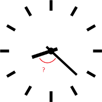
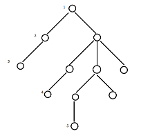

# Tasks
## Clock
Calculate the acute angle between clock's arrows.
Input and output from/to console.

## Tree
Tree structure:

    class Branch {List<Branch> branches;}

Using recursion calculate the longest path (heigth) of the tree.